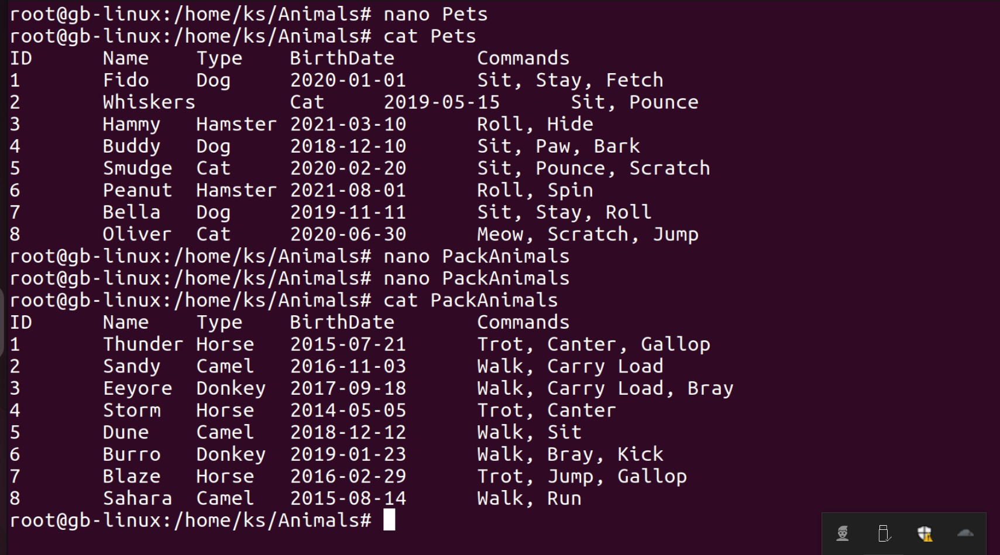
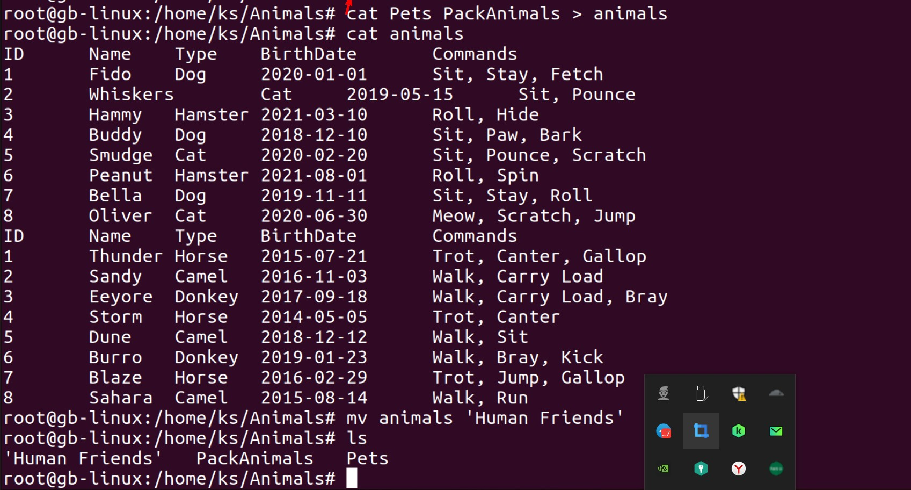
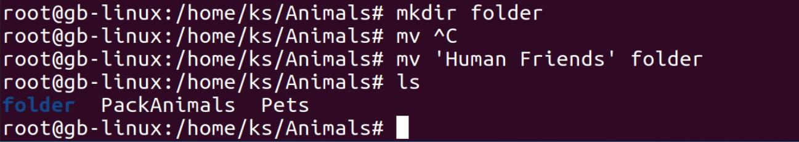
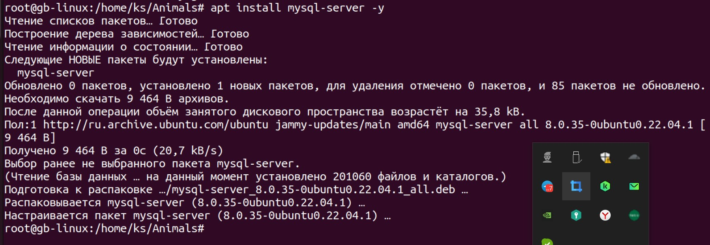
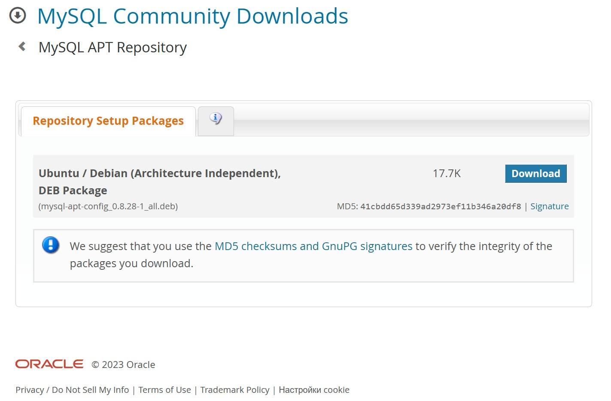
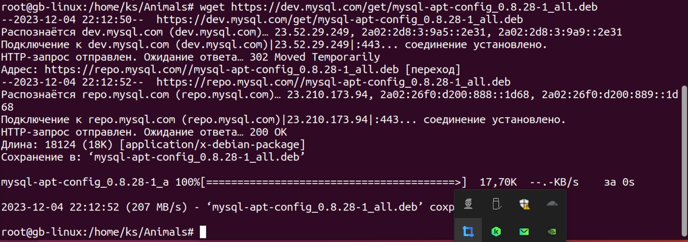

Задание 

Операционные системы и виртуализация (Linux)

1. Использование команды cat в Linux
   - Создать два текстовых файла: "Pets"(Домашние животные) и "Pack animals"(вьючные животные), используя команду `cat` в терминале Linux. В первом файле перечислить собак, кошек и хомяков. Во втором — лошадей, верблюдов и ослов.
   - Объединить содержимое этих двух файлов в один и просмотреть его содержимое.
   - Переименовать получившийся файл в "Human Friends"(.
Пример конечного вывода после команды “ls” :
Desktop Documents Downloads  HumanFriends.txt  Music  PackAnimals.txt  Pets.txt  Pictures  Videos

Приступаем
С помощью команды cat создадим два текстовых файла: "Pets"(Домашние животные) и "Pack animals"(вьючные животные). 
В первом файле перечислим собак, кошек и хомяков. 
Во втором — лошадей, верблюдов и ослов.

1.1. Объединим содержимое этих двух файлов в один. Затем переименуем получившийся файл командой mv в "Human Friends" 
и просмотрим его содержимое командой cat. 

1.2. Создадим новую директорию folder и переместим туда файл "Human Friends".

1.3. Установим и настроим MySQL на Linux Ubuntu 22.04.1 используя следующую команду:

1.4 Зайдём на сайт dev.mysql.com и найдем там название deb пакета MySQL APT Repository:

1.4.1 Скопируем название файла пакета deb и с помощью команды wget скачаем данный пакет в нашу текущую директорию. Установим скаченный пакет deb

