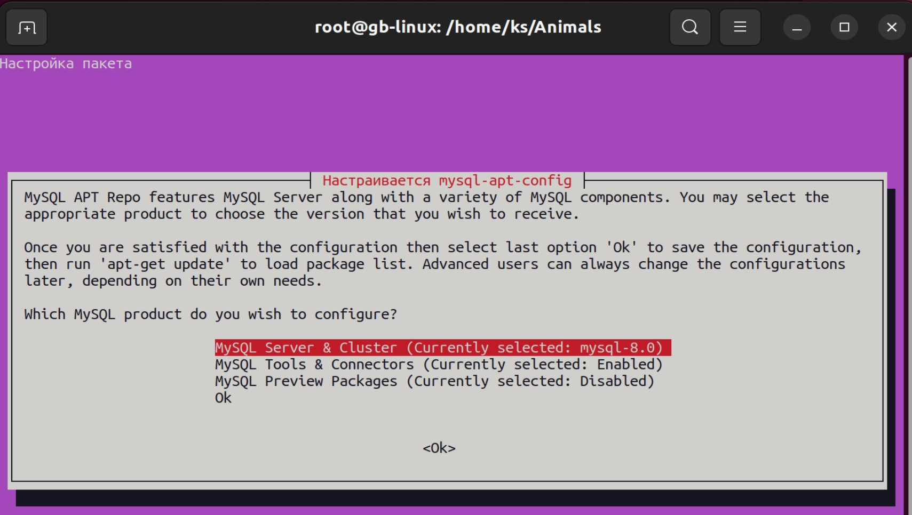
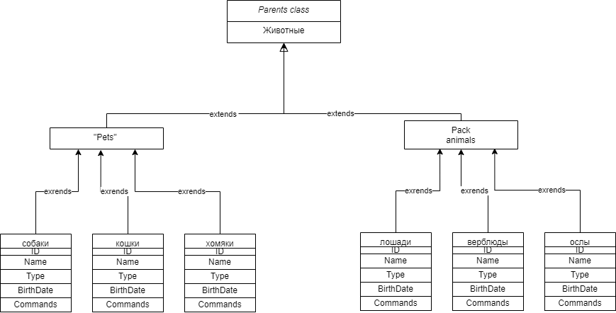
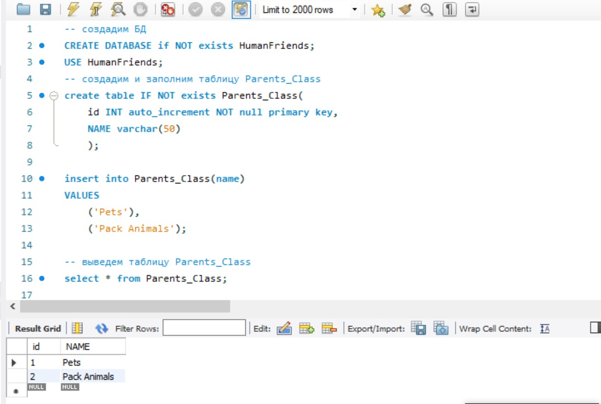
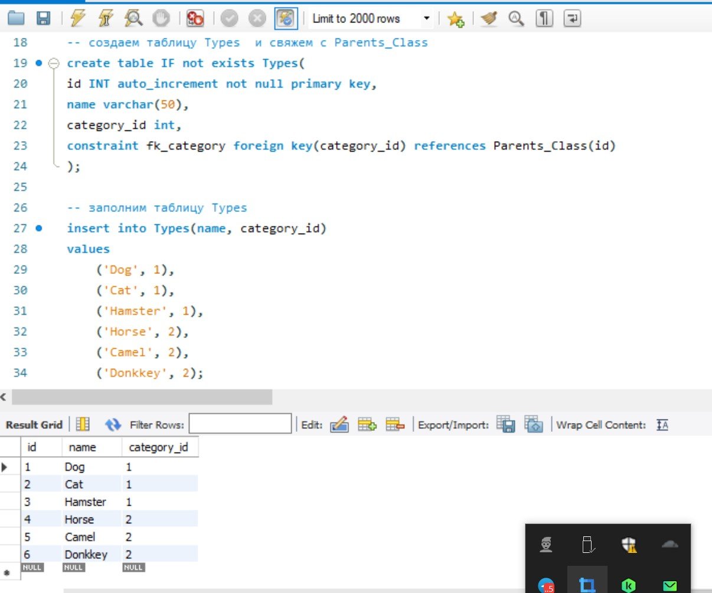
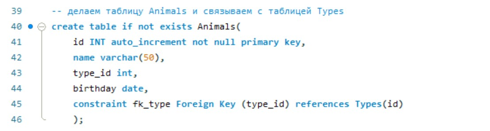

Задание 

Операционные системы и виртуализация (Linux)

1. Использование команды cat в Linux
   - Создать два текстовых файла: "Pets"(Домашние животные) и "Pack animals"(вьючные животные), используя команду `cat` в терминале Linux. В первом файле перечислить собак, кошек и хомяков. Во втором — лошадей, верблюдов и ослов.
   - Объединить содержимое этих двух файлов в один и просмотреть его содержимое.
   - Переименовать получившийся файл в "Human Friends"(.
Пример конечного вывода после команды “ls” :
Desktop Documents Downloads  HumanFriends.txt  Music  PackAnimals.txt  Pets.txt  Pictures  Videos

Приступаем
С помощью команды cat создадим два текстовых файла: "Pets"(Домашние животные) и "Pack animals"(вьючные животные). 
В первом файле перечислим собак, кошек и хомяков. 
Во втором — лошадей, верблюдов и ослов.

1.1. Объединим содержимое этих двух файлов в один. Затем переименуем получившийся файл командой mv в "Human Friends" 
и просмотрим его содержимое командой cat. 

1.2. Создадим новую директорию folder и переместим туда файл "Human Friends".

1.3. Установим и настроим MySQL на Linux Ubuntu 22.04.1 используя следующую команду:

1.4 Зайдём на сайт dev.mysql.com и найдем там название deb пакета MySQL APT Repository:

1.4.1 Скопируем название файла пакета deb и с помощью команды wget скачаем данный пакет в нашу текущую директорию. Установим скаченный пакет deb

1.4.2 и затем удалим его с помощью команды dpkg:

Объектно-ориентированное программирование 

6. Диаграмма классов
   - Создать диаграмму классов с родительским классом "Животные", и двумя подклассами: "Pets" и "Pack animals".
В составы классов которых в случае Pets войдут классы: собаки, кошки, хомяки, а в класс Pack animals войдут: Лошади, верблюды и ослы).
Каждый тип животных будет характеризоваться (например, имена, даты рождения, выполняемые команды и т.д)
Диаграмму можно нарисовать в любом редакторе, такими как Lucidchart, Draw.io, Microsoft Visio и других.

7.1. После создания диаграммы классов в 6 пункте, в 7 пункте база данных "Human Friends" должна быть структурирована в соответствии с этой диаграммой. Например, можно создать таблицы, которые будут соответствовать классам "Pets" и "Pack animals", и в этих таблицах будут поля, которые характеризуют каждый тип животных (например, имена, даты рождения, выполняемые команды и т.д.). 
7.2   - В ранее подключенном MySQL создать базу данных с названием "Human Friends".

   - Создать таблицы, соответствующие иерархии из вашей диаграммы классов.

   - Заполнить таблицы данными о животных, их командах и датами рождения.
   - Удалить записи о верблюдах и объединить таблицы лошадей и ослов.
   - Создать новую таблицу для животных в возрасте от 1 до 3 лет и вычислить их возраст с точностью до месяца.
   - Объединить все созданные таблицы в одну, сохраняя информацию о принадлежности к исходным таблицам.

